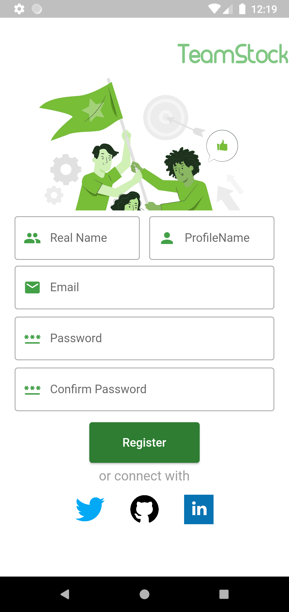

# Info
TeamStock is a online recruiting app that connects unemployed but inspired specialists and newbie businessmen through social network abilities. 
	This app allows users to create contacts, events, job-vacancies and interact with built-in messaging system.

# Used packages
Firebase Flutter, GetX

## Images

